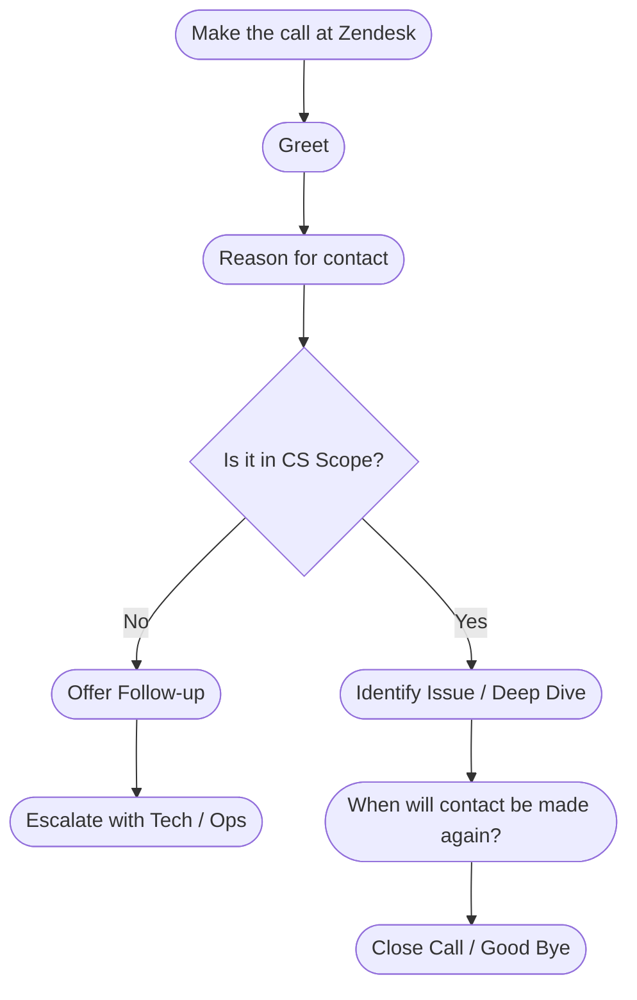

# **Purpose**

<Note>
  **Purpose of this document**

  This is an organized document with a set of guidelines that the Customer Success Team must follow while talking to customers. Call guides serve the **purpose** of providing a template, while not constraining you to any single mode of delivery. Call guides help maintain information and tone consistency.

  **Who should read this document?**

  Customer Success
</Note>

## **Step-by-Step Guide**

<Note>
  **What happened prior to this step?**

  Prior to talking to a customer, you should prepare for the meeting by

  1. Reviewing the customer’s account to form a proper analysis of the situation
  2. Reading any open Zendesk tickets submitted by the customer to get up to speed on current issues the customer might be facing
</Note>

### **Customer Success Call Template For First-Time Callers**

- Hi, this is \[name\] from the Customer Success Team at Latchel. How are you today? (Always remember to mention that you are part of the Latchel Customer Success Team)
- Great to hear! I’m doing very well, thank you for asking. (If the call is made from Zendesk please mention “This call is being recorded for quality assurance purposes”) How can I help you today?

### **Negative Work Order Experience**

- Thank you for bringing this to my attention. What can I do to help?
- I am sorry to hear that happened. If you give me the work order number, we can go ahead and start deep diving into this for you.
- Do you happen to have the work order # so I can review the logs and look into this further? 

### **Handling Angry Customers and Complaints**

- I’m so sorry this has happened. Let me see if I can find a way to fix things. Can I follow up with you after I deep dive into this issue?
- Can you tell me what happened so I can help?
- I’m really sorry that you weren’t happy with \_\_\_\_\_\_\_. Let’s see what we can do to set things right.
- I completely understand your frustration. Can I please have the work order number so we can perform a dive deep?

### **Following up With a Customer at a Later Time**

- \[Customer name\], I just wanted to let you know that we’re still looking into how we can resolve \[issue\]. Can I call you back within the next hour when we have some options for you?
- Sorry for the delay, \[customer name\]. Can I check on some of these with my manager and get back to you in the next hour?
- This deep dive may take a couple of days to be completed. Can I email or call you then? Which would you prefer?

### **Thanking Your Customers & Wrapping up**

- Thank you for your call. Do you have any other questions or concerns? 
  - **NO** → Great, thank you for your time. I hope you have a nice day.
  - **YES** → Ok, let’s take a look into that.
- Thanks for scheduling a call with our team, and please feel free to reach out to us if you need anything else.
- I’m so glad we could help and that you found exactly what you were looking for.
- Is there anything else I can do to help? Don’t hesitate to reach out to me. You can reach me by emailing [**<u>success@latchel.com</u>**](mailto:success@latchel.com) if you have any other questions or concerns.
- _(Review this guide with the customer for the best way to get in touch with Latchel regarding work orders [<u>https://latchel.com/blog/how-to-contact-latchel/</u>](https://latchel.com/blog/how-to-contact-latchel/))_
- If you have any other issues with your account, please let us know. Have a good day.