# **Purpose**

<Note>
  **Purpose of this document**

  The purpose of this document is to provide an overview of the Home Assistant Onboarding Process Flow and provide links to relevant SOPs and Templates used to communicate with customers.

  This page can also be used as a guide for new team members onboarding to the Customer Success Team that will be handling Onboarding.

  **Who should read this document?**

  Sales, Customer Success Team
</Note>

## **Step-by-Step Guide**

<Warning>
  **Prerequisites**

  1. [<u>Launch Manager Roles & Responsibilities</u>](https://latchel.atlassian.net/wiki/spaces/TH/pages/1896808651 "https://latchel.atlassian.net/wiki/spaces/TH/pages/1896808651")
  2. [<u>Customer Success Manager Role & Responsibilities</u>](https://latchel.atlassian.net/wiki/spaces/TH/pages/1930887326 "https://latchel.atlassian.net/wiki/spaces/TH/pages/1930887326")
  3. [<u>Recommended GL Code Setup (Customer Guide)</u>](https://latchel.com/gl-code-setup-home-assistant/ "https://latchel.com/gl-code-setup-home-assistant/")
  4. [<u>How to: Install Pg\_Admin4 and Set-up the Server</u>](https://latchel.atlassian.net/wiki/spaces/CS/pages/838469072/How+to+Install+Pg+Admin4+and+Set-up+the+Server "https://latchel.atlassian.net/wiki/spaces/CS/pages/838469072/How+to+Install+Pg+Admin4+and+Set-up+the+Server")
  5. [<u>How to: Execute SQL Queries in Pg\_Admin</u>](https://latchel.atlassian.net/wiki/spaces/CS/pages/865536465/How+to+Execute+SQL+Queries+in+Pg+Admin "https://latchel.atlassian.net/wiki/spaces/CS/pages/865536465/How+to+Execute+SQL+Queries+in+Pg+Admin")
  6. [<u>Home Assistant Product</u>](https://latchel.com/24-7-home-assistant/ "https://latchel.com/24-7-home-assistant/")
     - [<u>Job Aid: Latchel Product Features, Pricing and KPIs</u>](https://latchel.atlassian.net/wiki/spaces/LTG/pages/794526591 "https://latchel.atlassian.net/wiki/spaces/LTG/pages/794526591")
  7. [<u>How to: Utilize the Hubspot Onboarding Pipeline</u>](https://latchel.atlassian.net/wiki/spaces/CS/pages/943816897/CS+How+to+Utilize+the+Hubspot+Onboarding+Pipeline "https://latchel.atlassian.net/wiki/spaces/CS/pages/943816897/CS+How+to+Utilize+the+Hubspot+Onboarding+Pipeline") - _Needs help _
  8. [<u>Customer Data Collection SOPs </u>](https://latchel.atlassian.net/wiki/spaces/TST/pages/794002111 "https://latchel.atlassian.net/wiki/spaces/TST/pages/794002111")
  9. [<u>Account Creation and Configuration SOPs</u>](https://latchel.atlassian.net/wiki/spaces/TST/pages/794002118 "https://latchel.atlassian.net/wiki/spaces/TST/pages/794002118")
  10. [<u>Admin Configuration Exercise </u>](https://docs.google.com/document/d/1p6kFK1wxR7azvWZ2WrzTgZ5j-fwAVjhEFCpvv4b1sr8/edit "https://docs.google.com/document/d/1p6kFK1wxR7azvWZ2WrzTgZ5j-fwAVjhEFCpvv4b1sr8/edit")
  11. Property Manager Configuration Exercise - _pending_
  12. [<u>How to Audit GL Configurations</u>](https://latchel.atlassian.net/wiki/spaces/CS/pages/1922793508/Job-Aid+General+Ledger+Reports+-+Audit+Checklist "https://latchel.atlassian.net/wiki/spaces/CS/pages/1922793508/Job-Aid+General+Ledger+Reports+-+Audit+Checklist")
</Warning>

<Check>
  **<u>Sales Process (Pre-Onboarding)</u>**

  **An account must pass all steps in this sales process before it’s transferred to the Launch Manager/Onboarding Pipeline. **

  [<u>Sales Process Outline - </u>](https://docs.google.com/document/d/1FStXaYWAv-9xdzyPy4B-0mib7L8kUdtdaKNP6VAfa5Y/edit?usp=sharing "https://docs.google.com/document/d/1FStXaYWAv-9xdzyPy4B-0mib7L8kUdtdaKNP6VAfa5Y/edit?usp=sharing")<u>_pending_</u>
</Check>

### **Process Overview**

```mermaid
---
config:
  theme: base
  themeVariables:
    primaryColor: "#e8f4fd"
    primaryBorderColor: "#1a7abf"
    secondaryColor: "#f0f0f0"
    tertiaryColor: "#ffffff"
---
flowchart TD
    classDef stage fill:#1a7abf,color:#fff,font-weight:bold,stroke:#1a7abf
    classDef box fill:#f5f5f5,stroke:#aaa,color:#000,text-align:left
    classDef keybox fill:#cc0000,color:#fff,stroke:#cc0000

    KEY["🔑 KEY\nCSM: Customer Success Manager\nLM: Launch Manager\nCSA: Customer Success Assistant\nAE: Account Executive"]:::keybox

    S0(["Stage 0"]):::stage
    S1(["Stage 1"]):::stage
    S2(["Stage 2"]):::stage
    S3(["Stage 3"]):::stage
    S4(["Stage 4"]):::stage
    S5(["Stage 5"]):::stage
    S6(["Stage 6"]):::stage
    S7(["Stage 7"]):::stage

    KO["**Kick-Off Onboarding**\n─────────────────\n1. Internal Contract Review\n   Meeting (AE, LM, CSM)\n2. Prep Assets (LM)\n3. Prep Onboarding Checklist (LM)\n4. Share Onboarding Checklist (LM)\n5. Kick-Off Meeting with\n   the Customer (AE, LM, CSM)"]:::box

    SP["**Sales Process**\n─────────────────\n1. Pre-onboarding steps\n   completed by the\n   Account Executive (AE)"]:::box

    GD["**Gathering Data**\n─────────────────\n1. Monitor and push for needed\n   items to start the account\n   configurations (LM)"]:::box

    CF["**Configurations**\n─────────────────\n1. Create & Monitor\n   Configuration Tasks (LM)\n2. Complete Latchel action\n   items from the Onboarding\n   Checklist (LM)"]:::box

    CA["**Configuration Analysis**\n─────────────────\n1. Look at all existing leases\n   and determine when they\n   expire (CSA)"]:::box

    PL["**Pre-Launch**\n─────────────────\n1. Pre-Launch Meeting –\n   Product Training & Final\n   Review of the Onboarding\n   Checklist (LM, CSM)"]:::box

    OM["**Onboarding Meeting**\n─────────────────\n1. Onboarding Configuration\n   Meeting (LM, CSM)\n2. Identify Missing Information\n3. Follow-Up Email to Recap\n   Call Discussion"]:::box

    LA["**Launch**\n─────────────────\n1. Account Auditing Process (CSM)\n2. Account is Marked as Ready\n   to Go Live (CSM)\n3. Customer Welcome Email\n   is Sent (LM)\n4. Latchel Operations Team\n   is Notified of New Live\n   Account (LM)"]:::box

    S0 --> KO --> S1
    S1 --> SP
    S1 --> GD --> S2
    S2 --> CF --> S3
    S3 --> CA --> S4
    S4 --> S5
    S5 --> OM --> S6
    S6 --> PL --> S7
    S7 --> LA
```

##  **Step 1 - <u>Kick-Off Onboarding</u>**

1. **Account Executive \<\> Launch Manager \<\> Customer Success Manager Contract Review Meeting **
   - The Launch Manager is responsible for booking a meeting (same day as the sale closes) with the Account Executive that closed the deal and the assigned Customer Success Manager. The goal of this meeting is to internally review the company’s contract details in order to create an accurate onboarding checklist.
     - [<u>Contract Review Call Agenda</u>](https://latchel.atlassian.net/wiki/spaces/CS/pages/1903755278 "https://latchel.atlassian.net/wiki/spaces/CS/pages/1903755278")
2. **Prep the Home Assistant Onboarding Checklist **
   - Once the contract details are discussed, the Launch Manager [<u>preps an Onboarding Checklist</u>](https://latchel.coassemble.com/unlock/1tSCc0F "https://latchel.coassemble.com/unlock/1tSCc0F").
3. **Share the Home Assistant Onboard Checklist **
   - Once the checklist is ready, the Launch Manager will[<u> share the Onboarding Checklist with the Account Executive.</u>](https://latchel.coassemble.com/unlock/1tSCc0F "https://latchel.coassemble.com/unlock/1tSCc0F")
4. **Account Executive \<\> Launch Manager \<\> Customer Success Manager Kick-Off Meeting**
   - View the call objective & agenda here → [<u>Kick-Off Call Agenda</u>](https://latchel.atlassian.net/wiki/pages/createpage.action?spaceKey=cs&title=Do%20Not%20Use%20-%20Outdated%20Resource&linkCreation=true&fromPageId=1896775681 "https://latchel.atlassian.net/wiki/pages/createpage.action?spaceKey=cs&title=Do%20Not%20Use%20-%20Outdated%20Resource&linkCreation=true&fromPageId=1896775681")

## **Step 2 - <u>Gathering Data</u>**

1. **The Launch Manager will continue to monitor their inbox and the Onboarding Checklist for the information requested from customers.**
   - Once the information is received, move on to the next section (Configuration Tasks)
     - Missing Information Procedure - _pending _
     - Unresponsive Customer Procedure - _pending _

<Warning>
  **ATTENTION**

  Every time you gather files from the Property Manager, you should make a copy of it into the Property Manager-specific folder in the Customer Success Shared Drive. Use this SOP to guide you on [<u>How to: Handle Property Manager Specific Files</u>](https://latchel.atlassian.net/wiki/spaces/TST/pages/865469170 "https://latchel.atlassian.net/wiki/spaces/TST/pages/865469170") 
</Warning>

## **Step 3 -<u>Configuration Tasks</u>**

1. **Once customer data is received, the Launch Manager will create tasks for our Customer Success Assistant team. **
   - [How To Make a Task Request](https://latchel.atlassian.net/wiki/spaces/LTG/pages/863141952/Job-Aid+How+The+Task+Share+Program+Works#Job-Aid:HowTheTaskShareProgramWorks-step1Step1.MakeaTaskRequest\(allManagementTeam\))
2. **Once tasks are submitted, the Launch Manager will be responsible for tracking the tasks' statuses until completion.**
   - [<u>Step 4. Monitor Sprint Progress</u>](https://latchel.atlassian.net/wiki/spaces/LTG/pages/863141952/Job-Aid+How+The+Task+Share+Program+Works#Job-Aid%3AHowTheTaskShareProgramWorks-step4Step4.MonitorSprintProgressandCloseaSprint\(ProgramManager\) "https://latchel.atlassian.net/wiki/spaces/LTG/pages/863141952/Job-Aid+How+The+Task+Share+Program+Works#Job-Aid%3AHowTheTaskShareProgramWorks-step4Step4.MonitorSprintProgressandCloseaSprint(ProgramManager)") (Review step 4 → #1 a & B to learn about task progress and how to monitor the status of your submitted task. Same steps apply to all task requesters.)_ _
3. **The Launch Manager should also complete the Latchel basic/advanced configuration action items on the customer’s Onboarding Checklist **
   - [How to Manage Onboarding Checklists](https://latchel.coassemble.com/unlock/1tSCc0F "https://latchel.coassemble.com/unlock/1tSCc0F") 

<Warning>
  **ATTENTION**

  Every time you gather **files** from the Property Manager, you should make a copy of it into the Property Manager-specific folder in the Customer Success Shared Drive. Use this SOP to guide you on [<u>How to: Handle Property Manager Specific Files</u>](https://latchel.atlassian.net/wiki/spaces/TST/pages/865469170 "https://latchel.atlassian.net/wiki/spaces/TST/pages/865469170") 
</Warning>

## **Step 4 -  Configuration Analysis** 

1. _STEPS PENDING_

## **Step 5 - Onboarding - Configuration Meeting**

1. **Launch Manager Leads Onboard Configuration Meeting **
   - **During the call,** use the [<u>Onboard Call Guidelines/Note Taking Template </u>](https://docs.google.com/document/d/10v9Zkyts3jOTOJD4S7wGEPTCIOj88KyhAPjOWT3_plI/edit "https://docs.google.com/document/d/10v9Zkyts3jOTOJD4S7wGEPTCIOj88KyhAPjOWT3_plI/edit")to take notes of the information you have and highlight the information you don’t have and need to ask the customer for during the call.
     1. **_ATTENTION_**_ - the Customer Success Manager owning this call needs to review all information received so far and ONLY ask questions that we don't have the answer for it. We have received feedback that we ask repetitive questions or questions that they have already provided an answer to._
     2. _Also, make sure to include in your notes any changes to prior information received or other special requests. A Customer Success Manager will be auditing the account configurations before it goes live and will use your notes as the source of truth, <u>so make sure it is accurate</u>._
   - **At the end of the call,** the Launch Manager will schedule the Pre-Launch Meeting with the customer and the Customer Success Manager
2. **After the Onboarding Configuration Meeting, the Launch Manager reviews the information collected during the call vs. what is missing and summarizes what information is still needed, so it can be included in the follow-up email to the customer. Additionally, the Launch Manager will keep track of these action items in the customer’s Onboarding Checklist.**
   - Missing Information Procedure - _pending_
   - After Call Email Template - _Hubspot_

<Warning>
  **ATTENTION**

  Every time you gather **files** from the Property Manager and every time you are using the onboarding note taking **template**, you should make a copy of it into the Property Manager specific folder in the Customer Success Shared Drive Use this SOP to guide you on [<u>How to: Handle Property Manager Specific Files</u>](https://latchel.atlassian.net/wiki/spaces/TST/pages/865469170 "https://latchel.atlassian.net/wiki/spaces/TST/pages/865469170") 
</Warning>

## **Step 6 - <u>Onboarding - Pre-Launch Meeting</u>**

1. **After all information is received and configuration is complete the Launch Manager \<\> Customer Success Manager Lead a Pre-Launch Meeting with the customer**
   - Pre-Launch Meeting Agenda - _pending (add CSM product training to this meeting & schedule recurring weekly meeting - 60 min meetings_
2. **After the Pre-Launch Meeting, the Launch Manager will be responsible for making sure all Onboarding Checklist items are completed. Once complete, the Launch Manager will move this account in the onboard audit phase in Hubspot.**
   - Hubspot Onboarding Pipeline Overview - _Pending_

## **Step 7 -<u>Launch</u>**

1. **Once all configurations are completed, the assigned Customer Success Manager should audit all applicable configurations using the Go Live Check-list.**
   - [<u>How to Execute Go-Live Checklist</u>](https://latchel.atlassian.net/wiki/spaces/CS/pages/894895927/Draft+Job-Aid+How+to+Execute+the+Go+Live+Check-list "https://latchel.atlassian.net/wiki/spaces/CS/pages/894895927/Draft+Job-Aid+How+to+Execute+the+Go+Live+Check-list") _(need to add reporting queries and Verify Product Package Configuration step, opt in all unit step)_
2. **The Customer Success Manager will mark this account as ready to go live**
   - Hubspot Onboarding Pipeline Overview - _pending_
3. **The Launch Manager Sends an email to confirm those configurations were completed and the account is 100% onboarded.**
   - [<u>Welcome Email Template </u>](https://app.hubspot.com/email/6245849/edit/36128593546/content "https://app.hubspot.com/email/6245849/edit/36128593546/content")
4. **The Launch Manager will notify the Operation Team once the account is live **
   - [<u>How to Notify the Ops Team of New Customers</u>](https://latchel.coassemble.com/unlock/wHA2ENz "https://latchel.coassemble.com/unlock/wHA2ENz") _ _

## **<u>Process Quicklinks</u>** 

**Communication **

- Hubspot Onboarding Pipeline Overview
- Missing Information Procedure 
- Unresponsive Customer Procedure
- [<u>Hubspot LM Email Templates</u>](https://app.hubspot.com/email/6245849/manage/folder/36130898199 "https://app.hubspot.com/email/6245849/manage/folder/36130898199")
- [<u>How to Share the Onboarding Checklist </u>](https://latchel.coassemble.com/unlock/1tSCc0F "https://latchel.coassemble.com/unlock/1tSCc0F")

**Customize Material **

- [<u>How to Manage Onboarding Checklists</u>](https://latchel.coassemble.com/unlock/1tSCc0F "https://latchel.coassemble.com/unlock/1tSCc0F")
- [<u>How to Create Onboarding Checklists</u>](https://latchel.coassemble.com/unlock/1tSCc0F "https://latchel.coassemble.com/unlock/1tSCc0F")
  - How to Prep Home Assistant Assets 
  - How to Prep Resident & Vendor Communication Assets

**Configurations**

- [<u>How to Audit GL Configurations</u>](https://latchel.atlassian.net/wiki/spaces/CS/pages/1922793508/Job-Aid+General+Ledger+Reports+-+Audit+Checklist "https://latchel.atlassian.net/wiki/spaces/CS/pages/1922793508/Job-Aid+General+Ledger+Reports+-+Audit+Checklist") 
- [<u>How To Make a Task Request </u>](https://latchel.atlassian.net/wiki/spaces/LTG/pages/863141952/Job-Aid+How+The+Task+Share+Program+Works#Job-Aid:HowTheTaskShareProgramWorks-step1Step1.MakeaTaskRequest\(allManagementTeam\) "https://latchel.atlassian.net/wiki/spaces/LTG/pages/863141952/Job-Aid+How+The+Task+Share+Program+Works#Job-Aid:HowTheTaskShareProgramWorks-step1Step1.MakeaTaskRequest(allManagementTeam)")
- [<u>Monitor Sprint Progress</u>](https://latchel.atlassian.net/wiki/spaces/LTG/pages/863141952/Job-Aid+How+The+Task+Share+Program+Works#Job-Aid%3AHowTheTaskShareProgramWorks-step4Step4.MonitorSprintProgressandCloseaSprint\(ProgramManager\) "https://latchel.atlassian.net/wiki/spaces/LTG/pages/863141952/Job-Aid+How+The+Task+Share+Program+Works#Job-Aid%3AHowTheTaskShareProgramWorks-step4Step4.MonitorSprintProgressandCloseaSprint(ProgramManager)") 
  - (Review step 4 → #1 a & B to learn about task progress and how to monitor the status of your submitted task. Same steps apply to all task requesters.)_ _
- PropertyWare Integration
- [<u>Rent Manager Integration </u>](https://latchel.atlassian.net/wiki/spaces/CS/pages/1821081605/Rent+Manager+Integration+Steps+New+Customers "https://latchel.atlassian.net/wiki/spaces/CS/pages/1821081605/Rent+Manager+Integration+Steps+New+Customers")
- [<u>Appfolio Integration </u>](https://latchel.atlassian.net/wiki/spaces/CS/pages/813729953/CS+Admin+How+to+Install+the+Latchel+Data+Sync+Plug-in "https://latchel.atlassian.net/wiki/spaces/CS/pages/813729953/CS+Admin+How+to+Install+the+Latchel+Data+Sync+Plug-in")

**Meetings**

- [<u>Contract Review Meeting Agenda</u>](https://latchel.atlassian.net/wiki/spaces/CS/pages/1903755278 "https://latchel.atlassian.net/wiki/spaces/CS/pages/1903755278") 
- [<u>Kick-Off Call Agenda</u>](https://latchel.atlassian.net/wiki/pages/createpage.action?spaceKey=cs&title=Do%20Not%20Use%20-%20Outdated%20Resource&linkCreation=true&fromPageId=1896775681 "https://latchel.atlassian.net/wiki/pages/createpage.action?spaceKey=cs&title=Do%20Not%20Use%20-%20Outdated%20Resource&linkCreation=true&fromPageId=1896775681")
- [<u>Onboard Note Taking Template </u>](https://docs.google.com/document/d/10v9Zkyts3jOTOJD4S7wGEPTCIOj88KyhAPjOWT3_plI/edit "https://docs.google.com/document/d/10v9Zkyts3jOTOJD4S7wGEPTCIOj88KyhAPjOWT3_plI/edit")
- Pre-Launch Meeting Agenda 

**Launch**

- [<u>How to Execute Go-Live Checklist</u>](https://latchel.atlassian.net/wiki/spaces/CS/pages/894895927/Draft+Job-Aid+How+to+Execute+the+Go+Live+Check-list "https://latchel.atlassian.net/wiki/spaces/CS/pages/894895927/Draft+Job-Aid+How+to+Execute+the+Go+Live+Check-list")
- [<u>How to Notify the Ops Team of New Customers</u>](https://latchel.coassemble.com/unlock/wHA2ENz "https://latchel.coassemble.com/unlock/wHA2ENz")